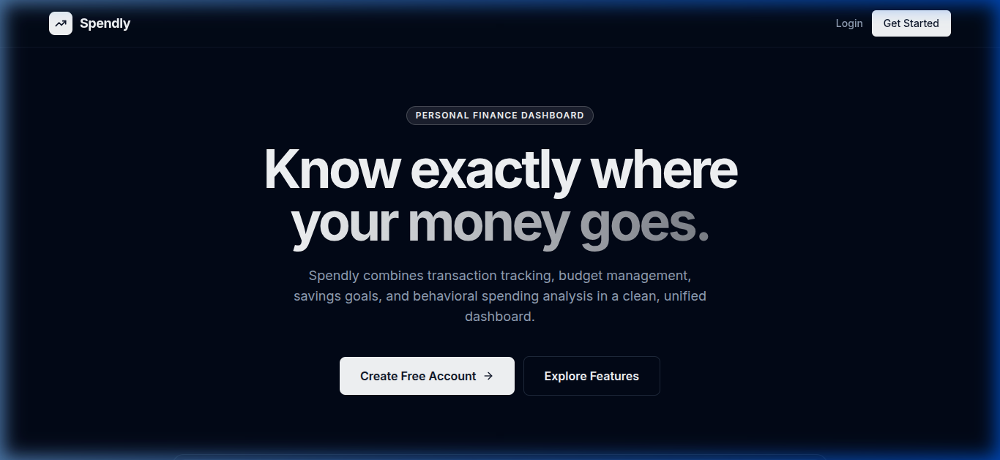
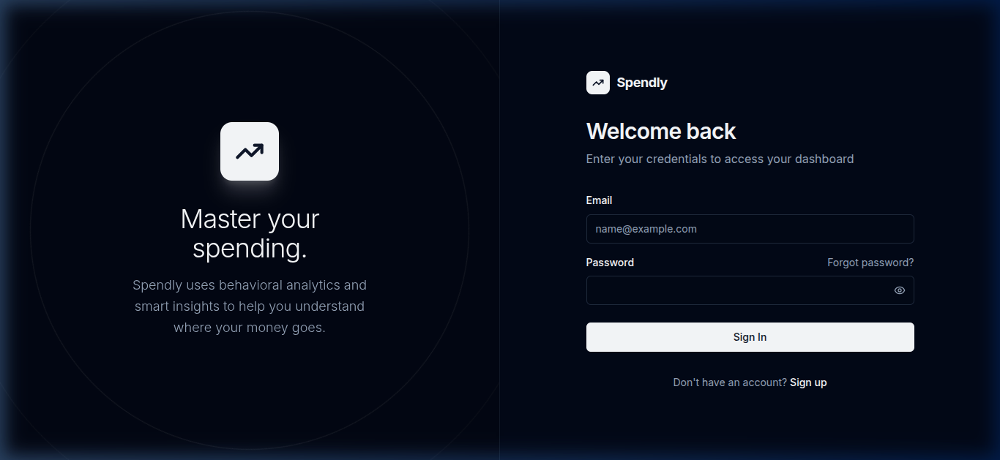
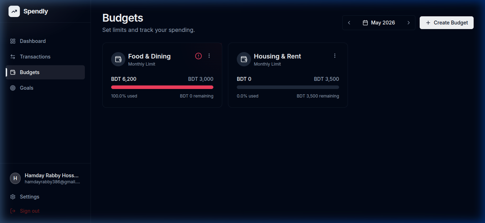

# 💰 Spendly — Personal Finance Dashboard

A full-stack **MERN** application for tracking personal finances. Built to go beyond simple transaction logging — Spendly provides behavioral spending analysis, budget management, savings goal tracking, and downloadable transaction reports in a clean, responsive dark-mode dashboard.

**Live Demo:** [spendly-production.up.railway.app](https://spendly-production.up.railway.app) _(update with your Railway URL)_

---

## 📸 Screenshots

### Landing Page


### Login


### Dashboard Overview


### Transaction Management


### Budget Tracking


### Savings Goals


### Analytics & Heatmap


---

## ✨ Features

| Feature | Description |
|---------|-------------|
| **Transaction Tracking** | Full CRUD for income and expenses with category filters, date range picker, search, and pagination |
| **Custom Categories** | Toggle between predefined categories or type a new custom one |
| **Budget Management** | Set monthly spending limits per category with real-time progress bars and overspend alerts |
| **Savings Goals** | Define targets with deadlines, contribute funds incrementally, and track completion |
| **Dashboard Overview** | Income vs. expense summary, savings rate metric, and category breakdown donut chart |
| **Download Transaction Report** | Generate a formatted HTML financial report and export as PDF via the browser print dialog |
| **Expense Heatmap** | GitHub-style yearly grid showing daily spending intensity |
| **Daily Spending Chart** | Smooth area chart of day-by-day expenses for the selected month |
| **Smart Insights** | Rule-based behavioral analysis — weekend patterns, category spikes, burn-rate prediction, recurring expense detection |
| **Dark Mode UI** | Sleek, responsive interface built with TailwindCSS and Framer Motion |

---

## ⚙️ Tech Stack

| Layer | Technology |
|-------|-----------|
| **Frontend** | React 19, Vite, TailwindCSS, Framer Motion |
| **State Management** | Tanstack Query (React Query v5) |
| **Forms & Validation** | React Hook Form + Zod |
| **Charts** | Recharts (Area, Donut, Heatmap) |
| **Backend** | Node.js, Express 5 |
| **Database** | MongoDB Atlas + Mongoose |
| **Authentication** | JWT (access + refresh tokens), bcrypt |
| **Security** | Helmet.js, CORS, Rate Limiting |
| **Deployment** | Railway (unified single-service) |

### Supporting Libraries

`Framer Motion` · `Recharts` · `Tanstack Query` · `React Hook Form` · `Zod` · `bcryptjs` · `JWT` · `TailwindCSS` · `react-datepicker` · `Helmet.js` · `Morgan` · `Mongoose`

---

## 🏗️ Project Structure

```
spendly/
├── client/                    # React frontend (Vite)
│   ├── src/
│   │   ├── components/        # Reusable UI (Logo, MonthYearPicker, MainLayout)
│   │   ├── context/           # AuthContext (JWT management, refresh queue)
│   │   ├── features/          # Feature-based modules
│   │   │   ├── auth/          # Login, Register
│   │   │   ├── dashboard/     # Dashboard, ExpenseHeatmap, DailySpendingChart
│   │   │   ├── transactions/  # Transaction CRUD + filtering
│   │   │   ├── budgets/       # Budget management
│   │   │   ├── goals/         # Savings goals
│   │   │   ├── analytics/     # Charts + Smart Insights
│   │   │   ├── settings/      # User settings
│   │   │   └── landing/       # Public landing page
│   │   └── lib/               # API client (Axios + interceptors), validators
│   └── index.html
├── server/                    # Express backend
│   ├── src/
│   │   ├── config/            # Database connection, environment validation
│   │   ├── middleware/        # Auth middleware (JWT verification)
│   │   ├── modules/           # Domain-driven modules
│   │   │   ├── auth/          # Register, Login, Refresh, Logout
│   │   │   ├── transactions/  # CRUD + validation
│   │   │   ├── budgets/       # Budget CRUD
│   │   │   ├── goals/         # Goal CRUD + contributions
│   │   │   ├── analytics/     # Aggregation pipelines + insights engine
│   │   │   └── categories/    # Category metadata endpoint
│   │   └── utils/             # Shared category definitions
│   ├── scripts/               # Database seed script
│   └── server.js              # Entry point
├── docs/screenshots/          # Project screenshots
└── package.json               # Unified build + start scripts
```

---

## 🚀 Getting Started

### Prerequisites

- Node.js ≥ 18
- MongoDB (local or [Atlas](https://www.mongodb.com/atlas))

### Setup

```bash
# 1. Clone the repository
git clone https://github.com/Hamdayrabby/spendly.git
cd spendly

# 2. Install all dependencies (client + server)
npm run install:all

# 3. Configure environment variables
cp server/.env.example server/.env
# Edit server/.env with your MONGO_URI and JWT_SECRET
```

### Environment Variables

| Variable | Description | Default |
|----------|-------------|---------|
| `PORT` | Server port | `5000` |
| `NODE_ENV` | Environment | `development` |
| `MONGO_URI` | MongoDB connection string | — *(required)* |
| `JWT_SECRET` | Secret for signing JWTs | — *(required)* |
| `JWT_EXPIRES_IN` | Access token lifetime | `15m` |
| `REFRESH_TOKEN_EXPIRES_IN` | Refresh token lifetime | `7d` |
| `CLIENT_URL` | Frontend URL for CORS | `http://localhost:5173` |

### Seed Demo Data (Optional)

```bash
cd server && npm run seed && cd ..
```

This creates a demo account with 3 months of sample transactions, budgets, and goals:

```
Email:    demo@spendly.com
Password: password123
```

### Run the Application

```bash
# Terminal 1 — Backend
npm run dev:server

# Terminal 2 — Frontend
npm run dev:client
```

Open **http://localhost:5173** in your browser.

---

## 🌐 API Endpoints

| Method | Endpoint | Auth | Description |
|--------|----------|------|-------------|
| `POST` | `/api/auth/register` | No | Create new account |
| `POST` | `/api/auth/login` | No | Login, returns access token + sets refresh cookie |
| `POST` | `/api/auth/refresh` | Cookie | Refresh access token |
| `POST` | `/api/auth/logout` | Yes | Clear refresh token cookie |
| `GET` | `/api/auth/me` | Yes | Get current user profile |
| `GET` | `/api/transactions` | Yes | List transactions (filterable, paginated) |
| `POST` | `/api/transactions` | Yes | Create transaction |
| `PUT` | `/api/transactions/:id` | Yes | Update transaction |
| `DELETE` | `/api/transactions/:id` | Yes | Delete transaction |
| `GET` | `/api/budgets` | Yes | List budgets with spend progress |
| `POST` | `/api/budgets` | Yes | Create/update budget |
| `DELETE` | `/api/budgets/:id` | Yes | Delete budget |
| `GET` | `/api/goals` | Yes | List savings goals |
| `POST` | `/api/goals` | Yes | Create goal |
| `PATCH` | `/api/goals/:id` | Yes | Update goal (add contribution) |
| `DELETE` | `/api/goals/:id` | Yes | Delete goal |
| `GET` | `/api/analytics/dashboard` | Yes | Dashboard summary + insights + categories |
| `GET` | `/api/analytics/heatmap` | Yes | Yearly expense heatmap data |
| `GET` | `/api/analytics/daily-spending` | Yes | Daily spending for area chart |
| `GET` | `/api/categories` | Yes | Category metadata (labels, colors, keys) |
| `GET` | `/api/health` | No | Health check endpoint |

---

## 🔒 Security

- Passwords hashed with **bcrypt** (salt rounds: 12)
- Access tokens are **short-lived JWTs (15m)** stored in memory only
- Refresh tokens are **7-day JWTs** stored in an **HTTP-only, SameSite=Strict cookie** — inaccessible to JavaScript
- **Token refresh queue** — prevents race conditions when multiple API calls fire during a token refresh
- Route-level rate limiting on all auth endpoints (20 req / 15min)
- Global rate limiter (100 req / 15min per IP)
- Helmet.js for HTTP security headers
- CORS restricted to the configured client origin
- Input validation on both client (Zod) and server (custom middleware)

---

## 🚢 Deployment (Railway)

The project is configured for **single-service deployment** on Railway:

- Express serves the React production build (`client/dist`) in production mode
- Root `package.json` has unified `build` and `start` scripts
- API calls use relative paths (`/api`) in production — no CORS issues

### Railway Variables Required

| Variable | Value |
|----------|-------|
| `MONGO_URI` | Your MongoDB Atlas connection string |
| `JWT_SECRET` | A long random secret string |
| `NODE_ENV` | `production` |
| `CLIENT_URL` | Your Railway deployment URL |

---

## 📝 Key Technical Decisions

1. **Token Refresh Queue** — When an access token expires, multiple API calls might fail simultaneously. Instead of each triggering a separate refresh, a queue pattern ensures only one refresh call is made while others wait and retry with the new token.

2. **MongoDB Aggregation Pipelines** — Analytics (heatmap, daily spending, category breakdown) are computed server-side using `$group`, `$sort`, and `$project` aggregation stages — not client-side loops.

3. **Rule-Based Smart Insights** — The insights engine uses 4 distinct pattern detectors (weekend overspending, category spikes, burn-rate prediction, recurring payments) without any external ML libraries.

4. **Shared Category Utility** — Categories are defined once in `server/src/utils/categories.js` and served via API. Both client validation and server aggregation reference the same source of truth.

5. **Express 5 Compatibility** — Uses the new `path-to-regexp` v8 wildcard syntax (`{*path}`) required by Express 5.

---

## 📄 License

MIT — [Hamdayrabby](https://github.com/Hamdayrabby)
